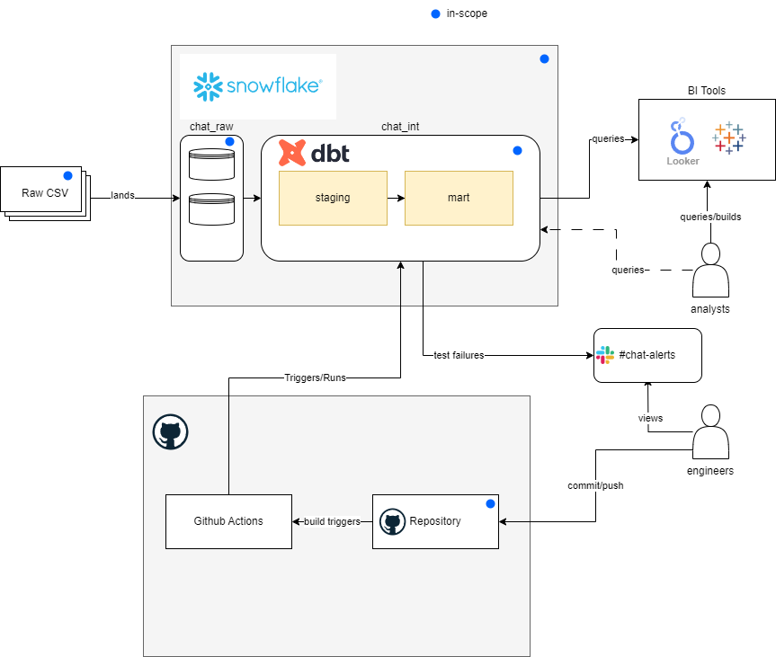

# Data Pipeline using Snowflake and dbt

## Overview

This project contains the source code and analysis for the Up Interview takehome work. 

The diagram below describes the wider architecture and in-scope work completed as part of this exercise. 

This data pipeline ingests raw CSV files into Snowflake and runs a dbt ETL process to transform the data. 

The pipeline processes data from the `chat_raw` database to the `chat_int` database.

## Pipeline Components

1. **Data Lake**: Raw CSV files are landed into Snowflake (expected, not in scope)
2. **dbt ETL Process**: Data is transformed using dbt from the `chat_raw` database to the `chat_int` database.
3. **Unit Testing**: Unit tests are run on each of the DBT tables/views.

## Setup 

### Snowflake 
An account is required to access the db in Snowflake. To run locally against your own warehouse you will need to run the following: 
- 1. Run the contents of `setup_snowflake.sql` in an empty SQL worksheet
- 2. Validate dbt_sa_role has required privileges against the warehouse and databases 

### dbt 
Once this repository is closed, dbt and the snowflake connector can be installed by running:
`pip install requirements.txt`

Update the following values in `chat_dbt/profiles.yml`:

- account: `snowflake account name. i.e. abcde-12234`
- password: `snowflake user password`
- user: `snowflake username`

## Project Structure 
- `analysis_answered` Contains the responses to the question instructions
- `chat_dbt` Contains the dbt project files for the ETL process
- `docs` Contains the dbt docs generated files for reference, including all sql questions and lineage. This can be viewed by accessing the pages: https://w4n2.github.io/de-assignment/
- `requirements.txt` Contains the pip install requirements
- `setup_snowflake.sql` Contains the initial script required to create the snowflake env 

## Data Governance Considerations
Data governence is everyones responsibility haha. Using out-of-the-box dbt solutions (along with dbt-utils and elementary) allows us to build a set of data quality tests that provide a level of trust and conformity in the data. Establishing a culture of data producers owning the data governence is also a vital part of how we would bring awareness and trust in the data. We want data producers to produce and record:
- What data their apps are producing
- How their data is validated
- What APIs are available
- How can others access those APIs to build further Data Products from (and repeat) 
- A centralised documation and standard build tools (such as dbt) would go a long way to maintain trust and a level of governence

## Todo
- Add dockerfile and build-push workflow in Github automated tagging 
- Consider Snowflake's version of Cloudrun to pull image from Docker artifactory and run the dbt container
- How to manage UAM and service account access 
- Consider where raw files are landed 
- Add in dbt contracts at staging to ensure raw files adhere to expected downstream standards and fail load/alert based on business operational needs 
- Publishing dbt docs in wider community for data visbility - i.e Backstage or similar enterprise documentation solutions 
- Add in elementary tests and publish the edr report to monitor test metrics over time 